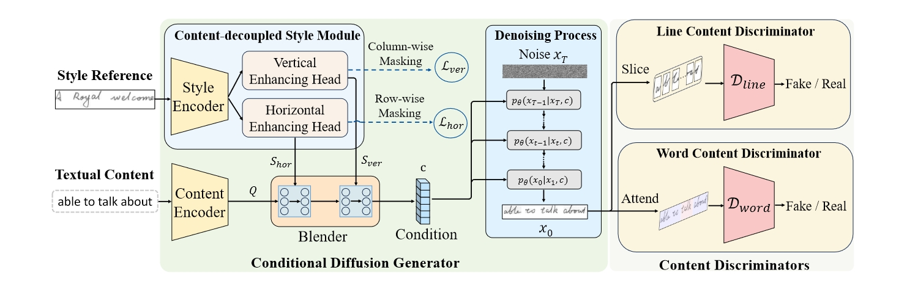

<h3 align="center"><a href="">🔥🔥Beyond Isolated Words: Diffusion Brush for Handwritten Text-Line Generation</a></h3>
<div align="center">
  <a href="https://arxiv.org/abs/2508.03256"></a>
  <a href="https://github.com/dailenson/DiffBrush/blob/main/assets/Poster__DiffBrush.pdf"></a>
  <a href="https://www.youtube.com/watch?v=VUMt-Ts6_rk"></a>
</div>
<br>
<!-- <a href="https://github.com/Ucas-HaoranWei/GOT-OCR2.0/"></a> -->

<!-- <a href="https://github.com/Ucas-HaoranWei/GOT-OCR2.0/blob/main/assets/wechat.jpg"></a> 
<a href="https://zhuanlan.zhihu.com/p/718163422"></a>  -->

<!-- [Gang Dai](https://scholar.google.com/citations?user=J4naK0MAAAAJ&hl=en), Yifan Zhang, Quhui Ke, Qiangya Guo, Lingyu Kong, Yanming Xu,  [Zheng Ge](https://joker316701882.github.io/), Liang Zhao, [Jianjian Sun](https://scholar.google.com/citations?user=MVZrGkYAAAAJ&hl=en), [Yuang Peng](https://scholar.google.com.hk/citations?user=J0ko04IAAAAJ&hl=zh-CN&oi=ao), Chunrui Han, [Xiangyu Zhang](https://scholar.google.com/citations?user=yuB-cfoAAAAJ&hl=en) -->

<!-- <p align="center">

</p> -->

## 🌟 Introduction
- To the best of our knowledge, DiffBrush is among the first to leverage diffusion generative models for handwritten text-line generation.
- DiffBrush introduces a novel content-decoupled style learning strategy that significantly enhances style imitation, along with a new multi-scale content learning strategy that boosts content accuracy.
- Extensive experiments on two popular English handwritten datasets and one Chinese dataset demonstrate that DiffBrush significantly outperforms state-of-the-arts.
<div style="display: flex; flex-direction: column; align-items: center; ">

</div>
<p align="center" style="margin-bottom: 10px;">
Overview of the proposed DiffBrush
</p>

## 🌠 News
- [2025/06/26] 🔥🔥🔥 [DiffBrush](https://github.com/dailenson/DiffBrush), a novel state-of-the-art approach for full-line text generation, is accepted to ICCV 2025.


## 🔨 Requirements
```
conda create -n Diffusion_Brush python=3.8 -y
conda activate Diffusion_Brush
# install all dependencies
conda env create -f environment.yml
```

## 🐳 Model Zoo


| Model|Google Drive|Baidu Netdisk|
|---------------|---------|-----------------------------------------|
|Pretrained DiffBrush|[Google Drive](https://drive.google.com/file/d/1EWzBmLtnQ42cTf3k_CYQ-nF3RXCb35I6/view?usp=drive_link)|[Baidu Netdisk](https://pan.baidu.com/s/1awe0z7LEixJhVQ1se0VikA?pwd=7udy)

**Note**:
The pre-trained stable-diffusion-v1-5 VAE model is available on Hugging Face. If you cannot access the pre-trained stable-diffusion-v1-5 VAE model available on Hugging Face, please refer to the [guidance](https://github.com/dailenson/One-DM/issues/22). After downloading the above files, please move them to /model_zoo.
## 🏋️ Test
 ```Shell
CUDA_VISIBLE_DEVICES=0,1,2,3 torchrun --nproc_per_node=4 generate.py \
    --cfg configs/IAM.yml --stable_dif_path ./model_zoo --dir <path_to_generated_image> \
    --pretrained_model model_zoo/<pretrained_model_checkpoint>
```
## 📺 Exhibition

- **Comparisons between our method and state-of-the-art approaches for handwritten text-line generation**
<p align="center">

</p>

- **Comparisons with One-DM on Chinese handwritten text-line generation.**
<p align="center">

</p>


## ❤️ Citation
If you find our work inspiring or use our codebase in your research, please cite our work:
```
@article{dai2025beyond,
  title={Beyond Isolated Words: Diffusion Brush for Handwritten Text-Line Generation},
  author={Dai, Gang and Zhang, Yifan and Qin, Yutao and Guo, Qiangya and Huang, Shuangping and Yan, Shuicheng},
  journal={arXiv preprint arXiv:2508.03256},
  year={2025}
}
```
## ⭐ StarGraph
[](https://www.star-history.com/#dailenson/DiffBrush&Timeline)
