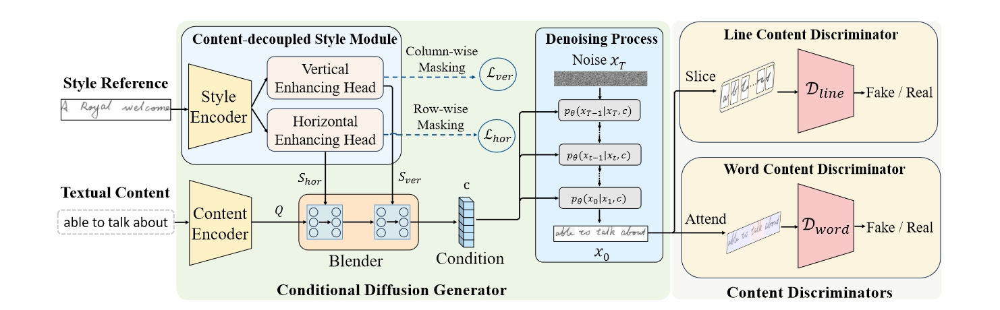

## Introduction
### Purpose of this fork
This fork intends to apply and possibly extend DiffBrush to support German.

### Training Dataset
Sources for training dataset:
- Main: [ScaDS.AI German Line- and Word-Level Handwriting Dataset](https://zenodo.org/records/18301532)
- Style diversity boost: [Fachhochschuel Südwestfalen: German Handwriting](https://huggingface.co/datasets/fhswf/german_handwriting)

## Original Paper: Beyond Isolated Words: Diffusion Brush for Handwritten Text-Line Generation
### Architecture

Architecture of DiffBrush

### Links
- Original GitHub for more informations: https://github.com/dailenson/DiffBrush
- Original Paper: https://arxiv.org/abs/2508.03256
```
@article{dai2025beyond,
  title={Beyond Isolated Words: Diffusion Brush for Handwritten Text-Line Generation},
  author={Dai, Gang and Zhang, Yifan and Qin, Yutao and Guo, Qiangya and Huang, Shuangping and Yan, Shuicheng},
  journal={arXiv preprint arXiv:2508.03256},
  year={2025}
}
```


